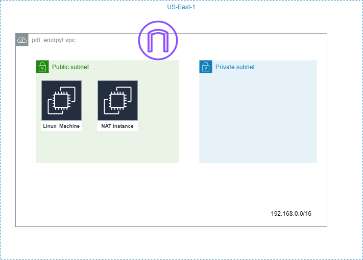

# Demo EC2 Instance for Decrypting Passwords using Another EC2 Instance

## Terraform:
Terraform was created as a tool to enable infrastructure as code. It provides provisions for mutable resources to ensure that there is no configuration drifting and eliminates the need for manual configuration on the console.

The architecture diagram to be used is attached below:
.

## Infrastructure Provisioned 
- **VPC**: This is your virtual private cloud. Despite being hosted on AWS, it is your enclosed networking environment where you can provision resources in any region of your choice. In this project, the default region is "us-east-1," but you can change it to any region you prefer. Learn more about VPC [here](https://docs.aws.amazon.com/vpc/latest/userguide/what-is-amazon-vpc.html).

   Resources set up in this VPC using the Terraform script include:
   1. Internet gateway: Allows access to the internet in the VPC.
   2. NAT Instance with EIP: Used for allowing resources in your public subnet to access the internet while preventing external traffic from reaching them.
   3. Public subnet: Allows both external and internal resources to be reached. This could include your webservers and load balancers.
   4. Private subnet: A subnet for critical resources that do not need internet access, such as databases and active directory.
   
   The Route table and route table ID define the routing of your various subnets in your VPC.

- **EC2**: Amazon EC2 (Elastic Compute Cloud) is an AWS web service offering resizable compute capacity in the cloud. It allows users to run virtual servers (instances) on-demand, quickly scaling them based on computing requirements for flexibility and cost efficiency. Users can choose instance types, operating systems, and storage options, making EC2 suitable for various workloads. Read more about [AWS EC2](https://docs.aws.amazon.com/ec2/?nc2=h_ql_doc_ec2).

   Setting up an EC2 instance involves configuring security groups, which act as firewall rules for an EC2 instance, determining which ports are open. In these EC2 instances, the following are set up:
   1. Windows instance security group (SG): Allows inbound traffic for HTTP, HTTPS, and RDP connections and permits all outbound traffic.
   2. Linux instance security group (SG): Allows HTTP, HTTPS, and SSH traffic to the instance and allows all outbound traffic.
   3. Linux Instance: This instance runs on the Amazon Linux image provided by AWS and is attached to a 50 GiB volume.
   4. User-data: This sets up applications you want installed on your instance while it is booting up.